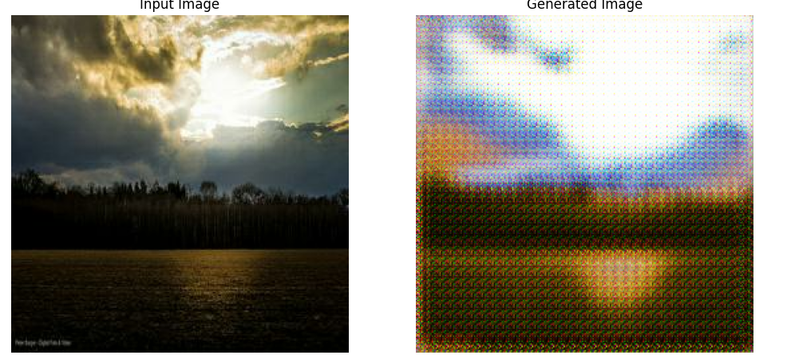
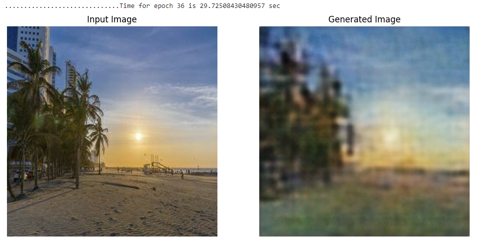
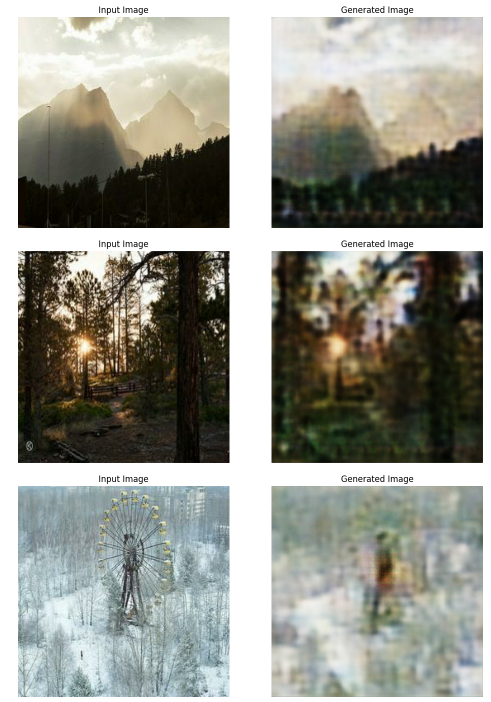

# GenerativeAI-StyleTransfer  
## CycleGAN with Enhanced Detail Capture  

This repository contains the implementation of a CycleGAN for unpaired image-to-image translation tasks, enhanced with a deeper generator network for improved detail capture. The project demonstrates significant improvements in translation quality through a two-phase training process and the use of a deeper generator network.

## Table of Contents
- [Introduction](#introduction)
- [Features](#features)
- [Two-Phase Training Approach](#two-phase-training-approach)
- [Deeper Generator Network](#deeper-generator-network)
- [Improvements](#improvements)
- [Usage](#usage)
- [Evaluation](#evaluation)
- [Results](#results)
- [Contributing](#contributing)

## Introduction  
CycleGANs are powerful models for unpaired image-to-image translation tasks. This project aims to enhance the standard CycleGAN architecture by using a deeper generator network and a two-phase training approach, leading to improved image quality and finer details in the generated images.

## Features  
- CycleGAN architecture for unpaired image-to-image translation  
- Two-phase training approach for improved convergence and accuracy  
- Deeper generator network for better detail capture  
- Significant improvement in MiFID score

## Two-Phase Training Approach  
Instead of using a pretrained model, I created an initial CycleGAN model in the first phase of training to understand the images and set the groundwork for further improvements. This model was then saved and further fine-tuned in the second phase with adjusted hyperparameters, allowing for better detail capture and faster convergence in later stages.

## Deeper Generator Network  
To further enhance the detail capture capability of the generator, a deeper generator network was introduced. This deeper architecture included additional layers to learn finer details in the images while keeping the discriminator unchanged.

## Improvements  
The combination of the two-phase training approach and the deeper generator network led to a significant reduction in the MiFID score from **202.53** to **93.82**, indicating substantial improvements in the quality of the generated images.

### From:  
  

### To:  
  

## Usage  
1. Prepare your dataset and organize it into appropriate folders.  
   - `https://www.kaggle.com/competitions/gan-getting-started/data`  
2. Train the CycleGAN model:  
3. Evaluate the model:  
4. Explore the extra approaches used or create new ones.  

## Evaluation  
### MiFID  
Submissions are evaluated using MiFID (Memorization-informed Fréchet Inception Distance), a modification of FID. The smaller the MiFID score, the better the quality of the generated images.

### What is FID?  
FID, along with Inception Score (IS), is a standard evaluation method for GANs. FID measures the distance between the feature distributions of real and generated images using a multivariate Gaussian distribution.

### What is MiFID?  
MiFID accounts for training sample memorization in addition to FID. Memorization distance is calculated using cosine distance between generated and real images, averaged across all user-generated samples. The final MiFID score is calculated as:

MiFID accounts for training sample memorization in addition to FID. The memorization distance is calculated using cosine distance between generated and real images, averaged across all user-generated samples. The final MiFID score is calculated as:

\[
\text{MiFID} = \text{FID} \cdot \max(1, d_{\text{mem}} - \epsilon)
\]

## Results  
Here are sample results comparing the original CycleGAN and the enhanced CycleGAN with the deeper generator network.  

## Contributing  
Contributions are welcome! Please submit a pull request or open an issue to discuss any changes.
